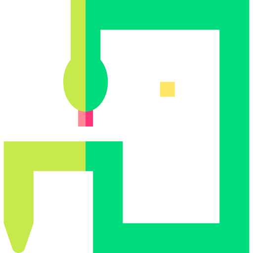

 

  

  <h3 align="center">Snake AR</h3>

  

Personal project inspirated in UnityList tutorial
     
    <a href="https://github.com/RicardOP-gdev/SnakeAR"><strong>Explore this repository »</strong></a>
     
     
    <a href="https://github.com/RicardOP-gdev/SnakeAR/tree/main/Scripts">Scripts</a>
  

<!-- PRESENTATION -->
## Description

Snake AR is a AR version of the classic Snake game. This project use AR Core technology to make it possible to use AR on Android devices. To play the game, first of all we must track the surface that we will use to play. Later the user will have the possibility to re-track a new surface if desired. 

